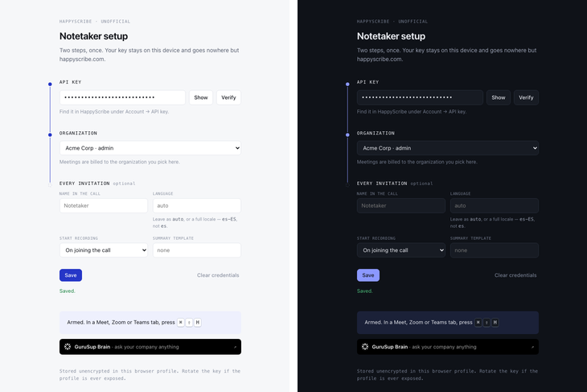

# HappyScribe Notetaker Invite

A Chrome extension that sends the HappyScribe notetaker into the meeting open in
your current tab — one keystroke, no detour through the HappyScribe web app.

> **Unofficial.** This project is not affiliated with, sponsored by, or endorsed
> by Happy Scribe. It is an independent tool that talks to the
> [public HappyScribe API](https://dev.happyscribe.com) using your own API key.
> "Happy Scribe" is a trademark of its owners and is used here descriptively, to
> say which service the extension works with. For HappyScribe support, contact
> Happy Scribe; for problems with this extension, open an issue here.



## Why

HappyScribe joins **scheduled** meetings on its own once you connect a calendar.
For the ad-hoc call — the one that starts because someone dropped a link in chat
— there is no calendar event, so you have to leave the call, open the HappyScribe
web app, paste the link, and dispatch the bot by hand.

This removes that detour. You are already in the call; press the shortcut.

## Install

Not on the Chrome Web Store. Load it unpacked:

1. Clone this repository.
2. Open `chrome://extensions` and turn on **Developer mode**.
3. Click **Load unpacked** and select the cloned folder.
4. Optional: visit `chrome://extensions/shortcuts` to change the keyboard
   shortcut (default `Ctrl+Shift+H`, `Cmd+Shift+H` on macOS).

No build step, no dependencies.

## Setup

Right-click the extension icon → **Options**.

1. Paste your API key — HappyScribe → Account → API key.
2. Click **Verify**. The extension fetches the organizations your key can act
   for, so you pick one by name instead of hunting for a numeric id.
3. Optionally set the defaults applied to every invitation: the bot's display
   name, transcription language, when recording starts, and a summary template.
4. **Save**.

Everyone using this brings their own key and their own organization. There is no
shared credential, no server, and no accounts to administer.

## Usage

With the meeting tab focused, press the shortcut or click the extension icon.
The badge on the icon reports what happened:

| Badge | Meaning |
|-------|---------|
| `...` | Request in flight |
| `OK`  | Bot dispatched |
| `?`   | This tab is not a supported meeting |
| `!`   | No API key or organization configured yet |
| `ERR` | The API refused — the reason is in the notification |

Supported: Google Meet, Zoom, Microsoft Teams. A call running in a desktop app
has no browser tab to read, so it is out of reach.

Pressing the shortcut twice on the same call will not put a second bot in the
room — HappyScribe dispatches one active bot per meeting URL.

## How it works

One call to `POST /api/v1/meetings` with the meeting URL from the active tab,
your organization id, and your defaults. No `join_at`, so the bot joins
immediately.

A few details that are less obvious than they look:

- **Requests come from the service worker, never from a content script.** Not a
  CORS workaround — the API's policy is permissive and would allow a page-context
  call. It is so your API key never enters the context of a page the extension
  does not control.
- **The query string is handled differently per provider.** Zoom's `?pwd=` and
  Teams' `?context=` carry what the bot needs to get in, so they are preserved.
  Meet's query string carries only per-profile noise (`authuser`, `pli`) which
  would make the same call look like two different meetings and defeat
  HappyScribe's deduplication, so it is stripped.
- **The badge clears on navigation, not on a timer.** A Chrome service worker is
  terminated when idle and takes any pending `setTimeout` with it, which would
  leave a stale result on the icon indefinitely.
- **`401` is the one error not passed through verbatim.** The API answers a bad
  key with `{"error":"Unauthorized"}`, which tells you nothing to do about it, so
  the extension points you at the options page instead. Every other status shows
  the API's own wording — including the genuinely useful `422` text when a URL is
  rejected.

## Permissions

| Permission | Why |
|------------|-----|
| `storage` | Keep your key, organization, and defaults on this device |
| `tabs` | Read the URL of the active tab to find the meeting link |
| `notifications` | Report success and, more importantly, failures |
| `host_permissions: happyscribe.com` | Call the HappyScribe API |

No `<all_urls>`, no content scripts, no analytics, no telemetry, and no network
destination other than the HappyScribe API.

## Security

Your API key is stored **in plain text** in `chrome.storage.local` — anyone with
access to your browser profile can read it. It is an organization-scoped key: it
can read that organization's transcriptions, and more depending on your role. Use
full-disk encryption, and rotate the key if you suspect the profile.

`storage.local` rather than `storage.sync` is deliberate, so the key is not
replicated to your Google account and from there to every browser you sign into.

**The extension does not encrypt the key, on purpose.** To use the key on every
invitation it would need the decryption key, which would sit in the same storage
area next to the ciphertext — whoever can read one can read the other. That
applies to WebCrypto with a stored key, XOR, and any obfuscation: a step, not a
barrier. The only variant with real value is a passphrase you type on every
browser restart, which defeats the point of a tool built to remove steps. If you
need a setup where users must not see the key at all, that is a proxy holding the
key server-side, not client-side cryptography.

**Consent:** recording a call has legal implications that vary by jurisdiction.
The bot only ever joins because you deliberately invited it. Tell the people in
the room.

## Development

Plain ES modules loaded directly by Chrome. No bundler, no transpiler, no runtime
dependencies — edit a file, hit reload in `chrome://extensions`.

```text
manifest.json     MV3 manifest: permissions, entry points, keyboard command
api.js            API client, settings, meeting-URL detection
background.js     Service worker: gesture → invite → badge and notification
options.html/js   Settings page
```

To check URL detection without a browser:

```bash
node -e 'globalThis.chrome={storage:{local:{get:async()=>({}),set:async()=>{}}}};
import("./api.js").then(m=>console.log(m.detectMeetingUrl(process.argv[1])))' "<url>"
```

Anything touching the network or the browser has to be verified by hand: load
unpacked, then exercise the path on a real Meet, a **password-protected** Zoom
link, and a Teams link. The passworded Zoom case is the one that catches URL
normalization mistakes.

## License

[MIT](LICENSE). The license covers the code in this repository and nothing else:
it grants no rights over Happy Scribe's trademarks, service, or API, and implies
no relationship with that company. Your use of the API is subject to Happy
Scribe's own terms.

The icon is this project's own — an enter-key glyph, because the whole extension
is one keystroke. It deliberately does not use Happy Scribe's mark: borrowing
their logo would suggest an affiliation that does not exist, and the Chrome Web
Store treats that as impersonation.
